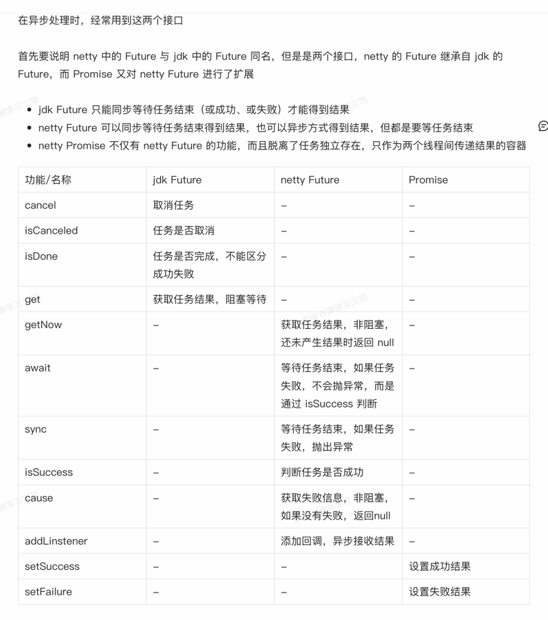

一 Netty的定义
    Netty是一个异步的、基于事件驱动的网络应用框架，用于快速开发可维护、高性能的网络服务器和客服端。

二 关于Netty组件的解释
    1.Channel - 可以理解为数据的通道
    2.Msg - 流动的数据，最开始从客户端输出时会讲String类型的数据转化为ByteBuf，经过pipeline中的各个handler加工，会变成其他类型对象，
最后输出又变成ByteBuf
    3.Handler - 数据的处理工序
    工序有多道，合在一起就是pipeline（传递途径） 。
    pipeline负责发布事件传播给每个handler，handler对自己感兴趣的事件进行处理（重写了感兴趣的事件处理方法）
    pipeline可以有多个handler，处理时会依次调用其中的handler，handler分为Inbound和Outbound两类，其中Inbound 为入站，Outbound为出站
    4.eventLoop可以理解为处理数据的工人
    eventLoop可以管理多个channel的io操作，并且一但eventLoop负责了某个channel，就会将其与channel进行绑定，以后该channel中的io操作都由该eventLoop负责
    eventLoop既可以执行IO操作，一可以进行任务处理，么个eventLoop有自己的任务队列，队列里可以堆放多个channel的待处理任务，任务分为普通任务、定时任务
    eventLoop按照pipeLine顺序，依次按照handler的规划处理数据，可以为每个handler指定不通的eventLoop

一个EventLoop可以负责多个

三 jdk future 与netty future 、 promise区别
